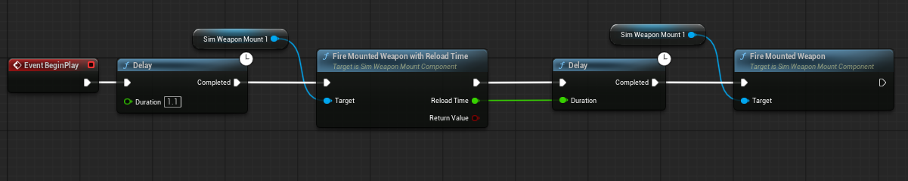

# SimWeapons

`SimWeapons` is an Unreal Engine plugin for creating modular weapon systems, combat carriers, projectiles, explosions, and active defense mechanics.

The plugin is designed for simulation projects where other systems, such as AI, sensors, radio communication, or vehicle movement, need to control weapons through a simple Blueprint/C++ API.

## What this plugin provides

* Weapon carrier components with health, energy, and weapon slot limits.
* Drone carrier component with recommended combat-drone parameters.
* Weapon mount components for attaching and firing weapons.
* Base weapon class with ammo, cooldown, battery cost, and slot cost.
* Base projectile class for explosive and non-explosive projectiles.
* Explosion component with radius damage, impulse, debug visualization, and chain reaction support.
* Ready-to-use weapon examples:

  * Rocket weapon
  * Bomb weapon
  * Mine weapon
  * Shotgun weapon
  * Defensive launcher / active protection weapon

## What this plugin does not provide

This plugin does not implement full AI, target detection, radar logic, radio networking, or drone movement.

Those systems should be implemented by other teams or game-specific logic. They can interact with this plugin by calling functions such as:

```text
FireMountedWeaponWithReloadTime
GetCurrentEnergy
ConsumeEnergy
GetCurrentHealth
ApplyDamage
GetMountedWeaponCurrentAmmo
```

## Installation

### 1. Create a `Plugins` folder

In the root folder of your Unreal Engine project, there should be a `Plugins` folder.

Example:

```text
YourProject/
├── YourProject.uproject
├── Content/
├── Source/
└── Plugins/
```

If the `Plugins` folder does not exist, create it manually.

### 2. Clone the plugin into the `Plugins` folder

Open a terminal inside the `Plugins` folder of your Unreal Engine project:

```bash
cd path/to/YourProject/Plugins
```

Clone the plugin repository:

```bash
git clone https://github.com/ukma-ue-simulation-course-2026/weapon-plugin.git SimWeapons
```

After that, the structure should look like this:

```text
YourProject/
└── Plugins/
    └── SimWeapons/
        ├── SimWeapons.uplugin
        ├── Source/
        ├── Content/
        ├── Resources/
        └── README.md
```

### 3. Open the Unreal Engine project

Open your project file:

```text
YourProject.uproject
```

If Unreal Engine asks to rebuild missing modules, click:

```text
Yes
```

Unreal Engine will try to build the C++ module of the plugin.

### 4. Enable the plugin

In Unreal Editor, open:

```text
Edit → Plugins
```

Search for:

```text
SimWeapons
```

Make sure the plugin is enabled.

If Unreal Engine asks to restart the editor, restart it.

## Manual build

If Unreal Engine cannot build the plugin automatically, close the editor and build the project manually.

Example for Unreal Engine 5.7 on Windows:

```powershell
& "C:\Program Files\Epic Games\UE_5.7\Engine\Build\BatchFiles\Build.bat" YourProjectEditor Win64 Development -Project="C:\Path\To\YourProject\YourProject.uproject" -WaitMutex
```

Replace:

```text
YourProjectEditor
```

with the name of your project editor target, and replace the project path with the real path to your `.uproject` file.

## Clean rebuild

If Blueprints do not see plugin C++ classes, or if a Blueprint says that it derives from an invalid class, close Unreal Editor and remove generated build folders.

From the root of your Unreal Engine project:

```powershell
Remove-Item -Recurse -Force ".\Binaries" -ErrorAction SilentlyContinue
Remove-Item -Recurse -Force ".\Intermediate" -ErrorAction SilentlyContinue
Remove-Item -Recurse -Force ".\.vs" -ErrorAction SilentlyContinue

Remove-Item -Recurse -Force ".\Plugins\SimWeapons\Binaries" -ErrorAction SilentlyContinue
Remove-Item -Recurse -Force ".\Plugins\SimWeapons\Intermediate" -ErrorAction SilentlyContinue
```

Then build again:

```powershell
& "C:\Program Files\Epic Games\UE_5.7\Engine\Build\BatchFiles\Build.bat" YourProjectEditor Win64 Development -Project="C:\Path\To\YourProject\YourProject.uproject" -WaitMutex
```

After a successful build, open the project again.

## How to check that the plugin works

The plugin is connected correctly if:

1. The Unreal Engine project opens without plugin errors.
2. `SimWeapons` is visible in `Edit → Plugins`.
3. The plugin is enabled.
4. The project compiles without errors.
5. `Show Plugin Content` is enabled and plugin Blueprints/content are visible in the Content Browser.
6. `Show C++ Classes` is enabled and `SimWeapons` C++ classes are visible.

Useful Content Browser settings:

```text
Content Browser → Settings → Show Plugin Content
Content Browser → Settings → Show C++ Classes
```

## Basic usage

A typical combat actor uses the following structure:

```text
Combat Drone / Vehicle Actor
├── Mesh
├── SimDroneCarrier or SimWeaponCarrierComponent
├── WeaponMount_0
├── WeaponMount_1
└── WeaponMount_2
```

The carrier component stores health, energy, and slot limits.

The weapon mount component stores the weapon class, spawns the weapon, and provides functions for firing it.

The weapon handles ammo, cooldown, and projectile spawning.

## Recommended drone setup

For a basic combat drone, use:

```text
MaxHealth = 100
MaxEnergy = 100

MaxWeaponSlots = 3
MaxSensorSlots = 3

Vision/Radar Sensor Cost = 1
Radio Message Send Cost = 1
Receiver Cost Per Second = 0.1
Movement Cost Per 100 cm/s Per Second = 0.1
```

Recommended weapon slot balance:

```text
Rocket Weapon = 2 slots
Bomb Weapon = 1 slot
Mine Weapon = 1 slot
Shotgun Weapon = 1 slot
Defensive Launcher = 1 slot
```

Valid example configurations:

```text
Rocket + Defensive Launcher = 3 slots
Shotgun + Mine + Defensive Launcher = 3 slots
Bomb + Mine + Shotgun = 3 slots
```

Invalid example:

```text
Rocket + Shotgun + Defensive Launcher = 4 slots
```

The invalid example requires more slots than the default drone allows.

## Important Blueprint API

### Energy

```text
GetCurrentEnergy()
GetMaxEnergy()
GetEnergyPercent()

SetEnergy(NewEnergy)
ConsumeEnergy(Amount)
HasEnoughEnergy(Amount)
```

### Health

```text
GetCurrentHealth()
GetMaxHealth()
GetHealthPercent()

SetHealth(NewHealth)
ApplyDamage(DamageAmount)
IsAlive()
IsDestroyed()
```

### Mounted weapon ammo

```text
GetMountedWeaponAmmo(MountIndex)
GetMountedWeaponCurrentAmmo(MountIndex)
GetMountedWeaponMaxAmmo(MountIndex)
GetMountedWeaponSlotCost(MountIndex)
```

`MountIndex` is the index of the weapon mount component on the actor.

### Firing weapons

Simple fire method:

```text
FireMountedWeapon()
```

Recommended fire method for combat systems:

```text
FireMountedWeaponWithReloadTime(out ReloadTime)
```

This method returns whether the weapon fired successfully and outputs the reload/cooldown delay.

Recommended combat flow:



## Troubleshooting

### Blueprint derives from an invalid class

If Unreal shows:

```text
Blueprint could not be loaded because it derives from an invalid class.
```

Do not click `Continue` immediately.

First check that the plugin C++ module is built correctly.

Recommended fix:

1. Close Unreal Editor.
2. Remove `Binaries` and `Intermediate` folders from the project.
3. Remove `Binaries` and `Intermediate` folders from `Plugins/SimWeapons`.
4. Generate Visual Studio project files.
5. Reopen the project.
7. Open affected Blueprints, then click `Compile` and `Save`.

### Weapon Class dropdown shows only `None`

This usually means one of the following:

```text
- The plugin C++ module was not built.
- The weapon Blueprint parent class is invalid.
- The weapon Blueprint was not compiled after C++ changes.
- The selected class is not derived from ASimWeaponBase.
```

Try a clean rebuild and then compile/save weapon Blueprints.

### Weapon does not spawn

Check:

```text
- WeaponClass is assigned on the WeaponMount component.
- The owner actor has a SimWeaponCarrierComponent or SimDroneCarrier component.
- The carrier has enough free weapon slots.
- The weapon slot cost does not exceed the carrier slot limit.
```

### Weapon does not fire

Check:

```text
- The spawned weapon has ammo.
- The weapon is not on cooldown.
- The carrier is alive.
- The weapon mount is calling the correct fire function.
```
